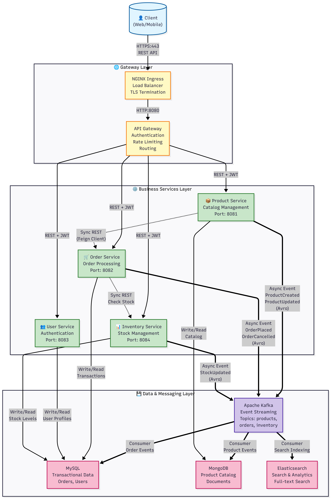
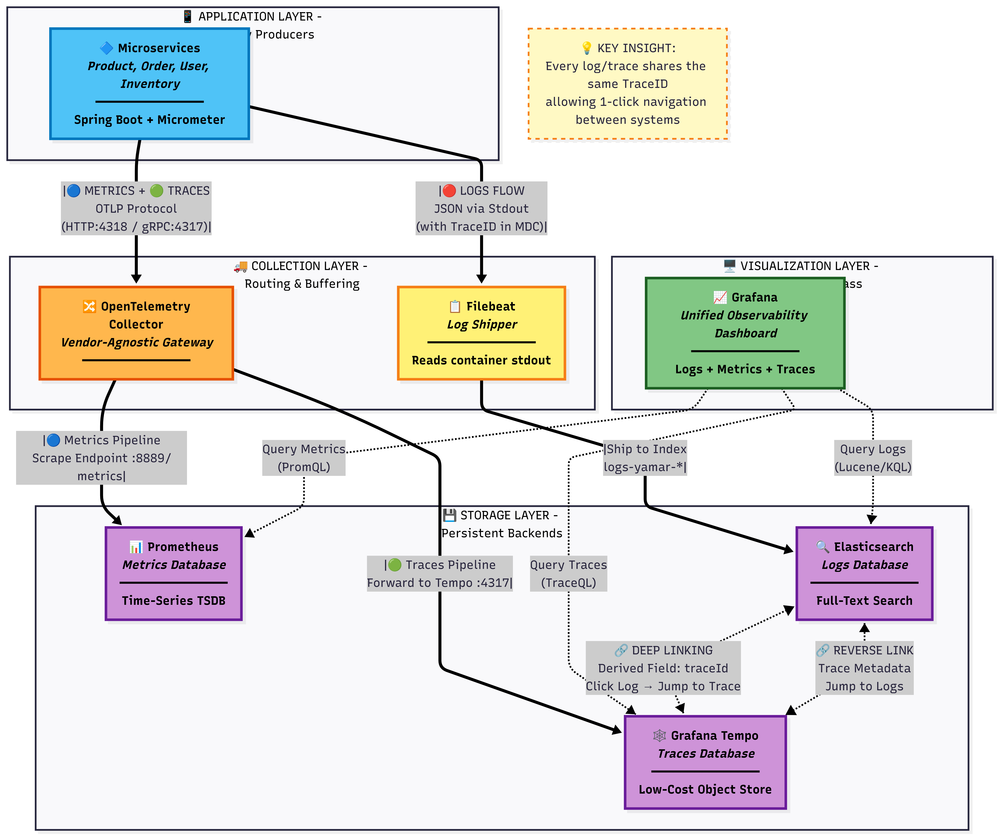
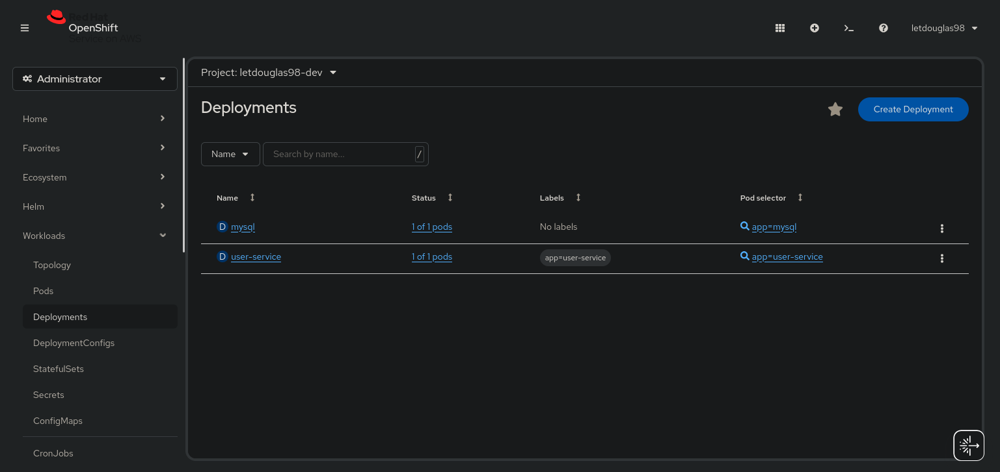
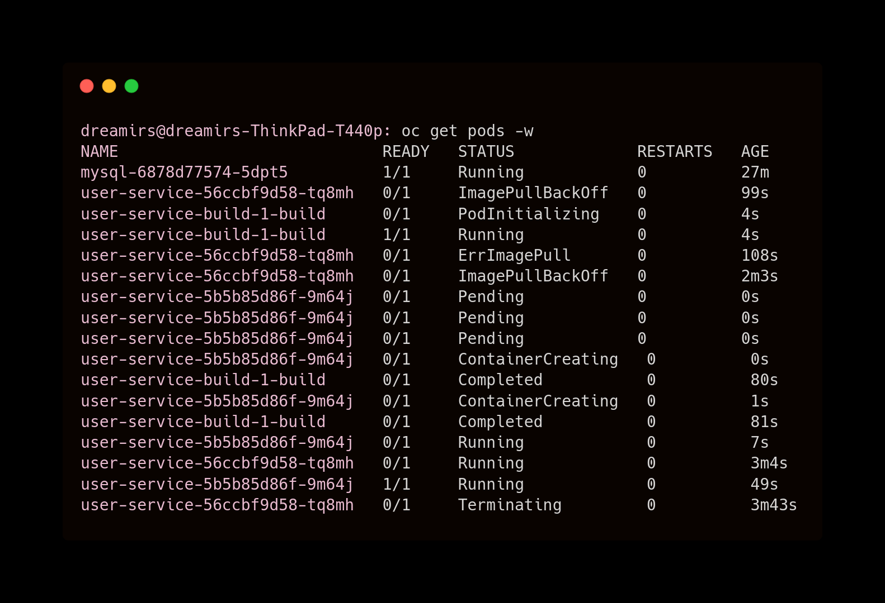

# 🏔️ YAMAR: A Cloud-Native E-Commerce Microservices Platform

-ED8B00?style=for-the-badge&logo=openjdk&logoColor=white)


YAMAR is a high-availability, event-driven microservices ecosystem designed to simulate a real-world, scalable e-commerce platform. It leverages advanced architectural patterns like CQRS (Command Query Responsibility Segregation), Polyglot Persistence, and asynchronous, choreographed sagas using Apache Kafka.

The entire infrastructure is defined as code (IaC), fully containerized, and designed for cloud-native orchestration. It supports a dual-mode development workflow for both rapid iteration (Docker Compose) and production simulation (Kubernetes).

---

## 📋 Table of Contents

- [System Architecture](#-system-architecture)
- [Architectural Decisions & Core Concepts](#-architectural-decisions--core-concepts)
- [Observability & Monitoring](#-observability--monitoring)
- [Technology Stack](#-technology-stack)
- [Local Observability Lab (Docker Compose)](#-local-observability-lab-docker-compose)
- [The Golden Path: Running on Kubernetes](#-the-golden-path-running-on-kubernetes)
- [Enterprise Platform Integration (Red Hat OpenShift)](#-enterprise-platform-integration-red-hat-openshift)
- [Troubleshooting Common Issues](#-troubleshooting-common-issues)
- [License](#-license)
- [Contributing](#-contributing)

---

## 🏗️ System Architecture

The ecosystem follows a Domain-Driven Design (DDD) approach, with each microservice representing a bounded context. Communication is handled through a mix of synchronous REST calls (via an API Gateway) for queries and asynchronous events (via Kafka) for commands and state changes, ensuring loose coupling and high resilience.



<details>
<summary><b>🔍 Deep Dive: Observability Stack Architecture</b></summary>

<br/>

To ensure production-grade reliability, YAMAR implements a complete three-pillar observability stack:



This architecture enables:
- **Distributed Tracing**: W3C TraceID propagation across all services
- **Structured Logging**: JSON logs with automatic TraceID injection
- **Metrics Collection**: Prometheus-compatible OTLP export
- **Unified Visualization**: Single Grafana dashboard with cross-pillar linking

</details>

---

## 🧠 Architectural Decisions & Core Concepts

This project is not just a collection of services; it's an implementation of key architectural patterns.

### CQRS for Product Catalog

To handle high-volume reads (searches, filtering) without impacting write performance (product creation, updates), the Product service is split:

- **Command Side**: All POST/PUT/DELETE operations write to MongoDB, the source of truth. An event is then published to Kafka.
- **Query Side**: A dedicated consumer listens to Kafka events and synchronizes the data into Elasticsearch, which serves all GET requests. This ensures the read path is extremely fast and scalable.

### Event-Driven Choreography

Critical business processes, like updating inventory after an order is placed, are decoupled. The Order Service publishes an `OrderPlacedEvent`. The Inventory Service (and potentially others, like Notifications) subscribes to this event and reacts independently. This avoids fragile, distributed transactions.

### Kubernetes Native Service Discovery

We intentionally avoid legacy service discovery tools like Eureka. The API Gateway and inter-service communication rely on Kubernetes' built-in DNS resolution (e.g., `http://order-service:8042`), which is the standard in modern cloud-native environments like OpenShift.

---

## 👁️ Observability & Monitoring

### The "Glass Box" Philosophy

We treat observability as a first-class citizen, not an afterthought. The system implements the "Three Pillars of Observability" fully decoupled from the application logic using the OpenTelemetry (OTLP) standard.

**Distributed Tracing (The "Digital Passport"):**
Every request is tagged with a W3C-compliant TraceID at the Gateway. Micrometer Tracing propagates this ID across synchronous REST calls and asynchronous Kafka events. Grafana Tempo stores the traces, allowing full waterfall visualization of the request lifecycle.

**Structured Logging (Contextualization):**
Human-readable text logs are banned in production. Applications emit JSON Logs (via Logback + LogstashEncoder). TraceID Injection means every log entry automatically includes the current `traceId` and `spanId` via MDC (Mapped Diagnostic Context), linking logs directly to traces. A Filebeat sidecar/daemon reads Docker container logs and ships them to Elasticsearch for centralized storage and search.

**Metrics (Health):**
Applications push metrics via OTLP to a central OpenTelemetry Collector. Prometheus scrapes the Collector (not the apps directly), ensuring architecture decoupling. This provides JVM metrics, HTTP request rates, and custom business metrics.

**Single Pane of Glass:**
Grafana unifies all three pillars. Deep Linking allows clicking on a log error to jump instantly to the trace timeline, and vice-versa. Derived fields automatically correlate logs to traces using the shared TraceID, eliminating the need to manually search across systems.

---

## 🛠️ Technology Stack

| Component | Technology | Role & Justification |
|-----------|-----------|---------------------|
| **Microservices** | Java 21 (LTS), Spring Boot 3.x | Modern, performant, and long-term supported runtime. |
| **Gateway** | Spring Cloud Gateway (Reactive) | Central entry point for routing, security (Token Relay), and resiliency (Circuit Breakers). |
| **Authentication** | Auth0 (OAuth2/OIDC) | Enterprise-grade identity management with JWT token validation. |
| **Messaging** | Kafka (KRaft mode), Avro, Schema Registry | Provides a durable, scalable event bus. Avro ensures schema evolution and type safety. |
| **Persistence** | MongoDB, MySQL 8, Elasticsearch 8 | Polyglot Persistence: Using the best database for the job (Mongo for documents, MySQL for transactions, Elastic for search). |
| **Collection** | OpenTelemetry Collector | Vendor-agnostic proxy that receives, batches, and routes telemetry data. |
| **Metrics DB** | Prometheus | Time-series database for storing JVM, HTTP, and System metrics. |
| **Tracing DB** | Grafana Tempo | High-volume, cost-effective backend for distributed traces. |
| **Log Shipper** | Filebeat | Lightweight shipper that forwards container logs to Elasticsearch. |
| **Visualization** | Grafana | The UI for dashboards and exploring correlated data (Logs ↔ Traces). |
| **Orchestration** | Kubernetes (via Kind for local dev) | The de-facto standard for container orchestration. |
| **Package Mgmt** | Helm 3 | Manages complex, stateful dependencies (Kafka, DBs) as reusable charts. |
| **Dev Workflow** | Skaffold | Enables a "live-reload" development experience directly on Kubernetes. |
| **Build System** | Maven | Manages dependencies and build lifecycle, optimized with `dependency:go-offline`. |

---

## 🧪 Local Observability Lab (Docker Compose)

While Kubernetes is the target for production, we provide a full Docker Compose environment to test the Observability Stack locally without the overhead of a cluster.

### Quick Start

```bash
cd infra/docker
docker-compose up -d --build
```

### Access Points

- **Grafana** (Dashboards): http://localhost:3000 (User: `admin` / Pass: `yamar`)
- **Prometheus** (Metrics): http://localhost:9090
- **Tempo** (Traces): http://localhost:3200
- **API Gateway**: http://localhost:8080 (Note: Port changed from 9090 to avoid conflict with Prometheus)

### Verification Steps

1. **Generate traffic**: `curl http://localhost:8080/api/v1/products`
2. Open Grafana → **Explore**
3. Select **Tempo** datasource → Click **Search** → Select a trace to view the full transaction path
4. Select **Elasticsearch** datasource → Verify logs contain the `traceId`

---

## 🚀 The Golden Path: Running on Kubernetes

This is the recommended workflow for a production-like experience.

### 1. Prerequisites

- **Java 21 SDK**
- **Docker Engine**
- **Kind** (`brew install kind`)
- **Kubectl** (`brew install kubectl`)
- **Helm** (`brew install helm`)
- **Skaffold** (`brew install skaffold`)
- **Auth0 Account** (free tier available at [auth0.com](https://auth0.com))

### 2. Cluster Creation & Setup (One-Time)

#### Step 2.1: Create the Kind Cluster

This command creates a local Kubernetes cluster with port 80 mapped to your localhost for the Ingress controller.

```bash
kind create cluster --config infra/k8s/kind-config.yml
```

#### Step 2.2: ⚡ Performance Boost (Highly Recommended for Laptops)

A full infrastructure stack is heavy. To prevent timeouts, pre-load the large container images into your Kind cluster before deployment.

```bash
# Pull heavy infrastructure images from Docker Hub
docker pull bitnami/mongodb:latest
docker pull bitnamilegacy/kafka:latest
docker pull bitnamilegacy/elasticsearch:latest
docker pull bitnamilegacy/schema-registry:latest

# Load them directly into the Kind cluster nodes
kind load docker-image bitnami/mongodb:latest
kind load docker-image bitnamilegacy/kafka:latest
kind load docker-image bitnamilegacy/elasticsearch:latest
kind load docker-image bitnamilegacy/schema-registry:latest
```

#### Step 2.3: Install the Ingress Controller

Kind does not come with a built-in Ingress controller. We must install one to handle external traffic.

```bash
# Apply the official NGINX Ingress manifest for Kind
kubectl apply -f https://raw.githubusercontent.com/kubernetes/ingress-nginx/main/deploy/static/provider/kind/deploy.yaml

# Wait for the controller to be ready before proceeding
echo "Waiting for Ingress Controller to become ready..."
kubectl wait --namespace ingress-nginx \
  --for=condition=ready pod \
  --selector=app.kubernetes.io/component=controller \
  --timeout=120s
```

### 3. Final Configuration: Auth0 Secrets

This project uses OAuth2/OIDC for security. Before deploying, you must provide your Auth0 tenant URI. **This is the only manual configuration step required.**

#### 3.1 Get your Auth0 Issuer URI

Log into your [Auth0 Dashboard](https://manage.auth0.com/) and find your "Issuer" URL (e.g., `https://your-tenant.us.auth0.com/`).

#### 3.2 Encode the URI in Base64

Open a terminal and run the following command, replacing the URL with your own:

```bash
echo -n "https://your-tenant.us.auth0.com/" | base64
```

This will output a Base64 string (e.g., `aHR0cHM6Ly95b3VyLXRlbmFudC51cy5hdXRoMC5jb20v`).

#### 3.3 Update the Central Secret

Open `infra/k8s/base/secrets.yml` and replace the placeholder for `auth0-issuer-uri` with the Base64 string you just generated.

```yaml
# infra/k8s/base/secrets.yml
apiVersion: v1
kind: Secret
metadata:
  name: yamar-secrets
type: Opaque
data:
  # ... other secrets
  auth0-issuer-uri: YOUR_BASE64_ENCODED_STRING_HERE
```

All microservices will automatically inherit this value upon deployment.

### 4. Deploy the YAMAR Ecosystem

This single command starts the entire process: Skaffold builds the microservice images, deploys the Helm charts, and tails the logs from all pods. Any change to your Java code will trigger a fast, hot-redeploy of the specific service.

```bash
skaffold dev
```

> **Note:** The very first build will be slow as it creates a cached layer of all Maven dependencies. Subsequent builds will be **extremely fast** (<1 minute).

### 5. Validation

Once all pods are stable, access the system via the Ingress endpoint:

- **API Gateway:** `http://api.127.0.0.1.nip.io`

You can test connectivity with a `curl` command. Expect a `401 Unauthorized` response, which confirms the security layer is active.

```bash
curl -i http://api.127.0.0.1.nip.io/api/v1/products
```

---

## ☁️ Enterprise Platform Integration (Red Hat OpenShift)
> **Highlight:** Fully Automated Native CI/CD Pipeline

Beyond standard Kubernetes, YAMAR features a dedicated configuration for **Red Hat OpenShift Container Platform**, implementing an enterprise-grade workflow focused on automation, platform security, and cloud-native build strategies.

### Platform Validation & Status
The following captures demonstrate the system's ability to self-heal and automate the delivery process from code to production.

|                 **Cluster Status (Administrator View)**                  |                          **Automated CI/CD (Self-Healing)**                           |
|:------------------------------------------------------------------------:|:-------------------------------------------------------------------------------------:|
|  |  |

#### Key Implementation Highlights:
- **📦 Native S2I Pipeline**: Direct source-to-image compilation inside the cluster using Red Hat UBI images, ensuring a secure and standardized build environment.
- **🔄 GitHub Webhook Integration**: Fully automated build-and-deploy cycle triggered on every `git push`, enabling a true Continuous Deployment experience.
- **🔐 RBAC Security Tuning**: Custom `RoleBinding` to manage secure external API access for triggers, resolving standard permission constraints in public cloud environments.
- **💾 Persistent Data Layer**: MySQL instance backed by a `PersistentVolumeClaim` (PVC) to guarantee data durability across pod lifecycles.

👉 **[Read the Full OpenShift Technical Documentation & Manifests](./infra/openshift/README.md)**

---

## 🚑 Troubleshooting Common Issues

Encountering errors is part of the local Kubernetes experience, especially on resource-constrained machines.

| Problem | Symptoms | Solution |
|---------|----------|----------|
| **Disk Full** | Elasticsearch logs show "flood stage disk watermark exceeded". The API returns 503 Service Unavailable with `NoShardAvailableActionException`. | Your Docker environment has run out of disk space. Run `docker system prune -a --force` to clean up unused images/volumes. On Mac/Windows, increase the "Disk Image Size" in Docker Desktop settings. On Linux, clean your main partition (`df -h`). |
| **Resource Starvation** | Pods are stuck in `CrashLoopBackOff` or `Running (0/1)`. Skaffold reports "exceeded its progress deadline". Java apps start very slowly (> 2 minutes). | Your machine is out of CPU/RAM. 1) Increase resources allocated to Docker (Settings > Resources). 2) As a workaround, increase the `initialDelaySeconds` in the `livenessProbe` and `readinessProbe` sections of the deployment.yml files to give the apps more time to start. |
| **Flyway Checksum** | The application fails to start with "Migration checksum mismatch". | You have modified a Flyway SQL migration file that has already been applied. Solution for Dev: Set `SPRING_FLYWAY_CLEAN_ON_VALIDATION_ERROR: "true"` in the ConfigMap to automatically wipe and recreate the database on error. |
| **Slow Builds** | Every code change triggers a 10-minute build, re-downloading all Maven dependencies. | Your Dockerfiles are not optimized for layer caching. Ensure they follow a multi-stage pattern where `mvn dependency:go-offline` is run in a separate layer before the source code is copied. |
| **Ingress 502/Reset** | `curl` to `api.127.0.0.1.nip.io` results in "Connection Reset". | You forgot to install the NGINX Ingress Controller. Follow Step 2.3 of the setup guide. |
| **Auth0 401 Errors** | All API requests return `401 Unauthorized` even with valid tokens. | Check that your Auth0 Issuer URI is correctly Base64 encoded in `secrets.yml`. Use `echo "YOUR_BASE64_STRING" \| base64 -d` to verify the decoded value matches your Auth0 tenant URL. |

---

## 📝 License

This project is developed for educational and portfolio purposes.

## 🤝 Contributing

Contributions, issues, and feature requests are welcome! Feel free to check the issues page.

---

**Built with ❤️ for demonstrating Cloud-Native Architecture Best Practices**