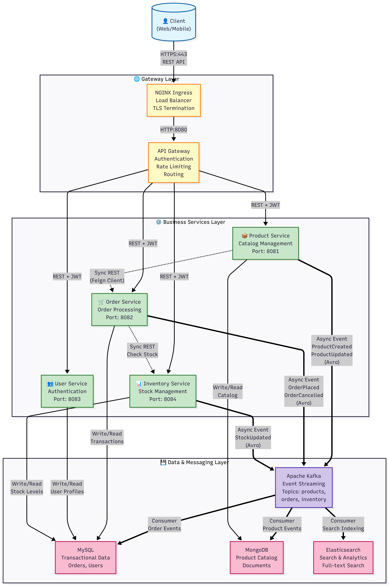
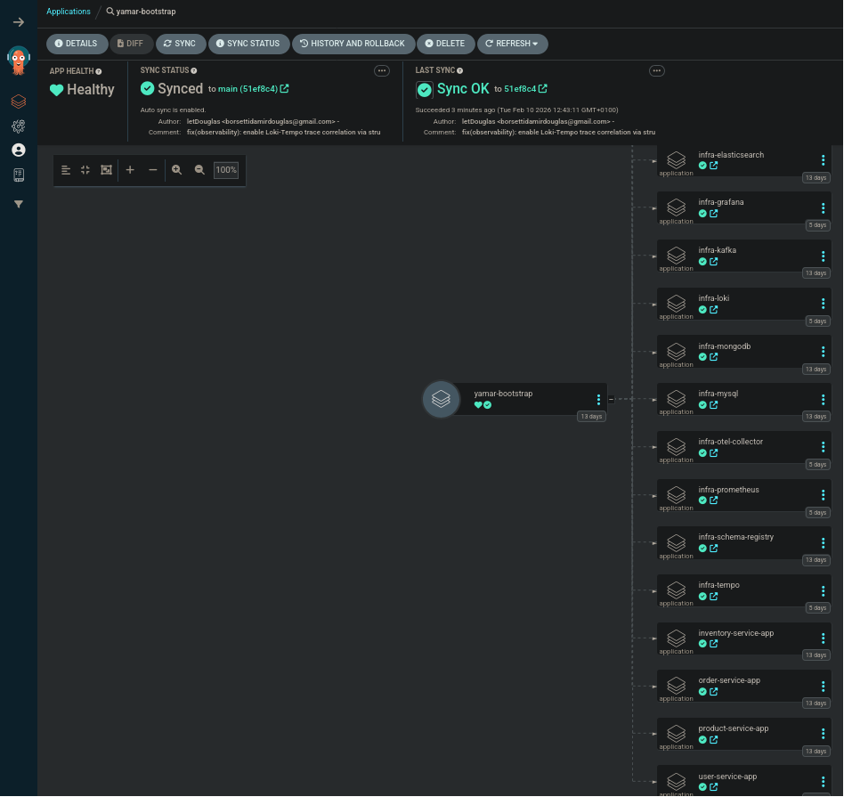
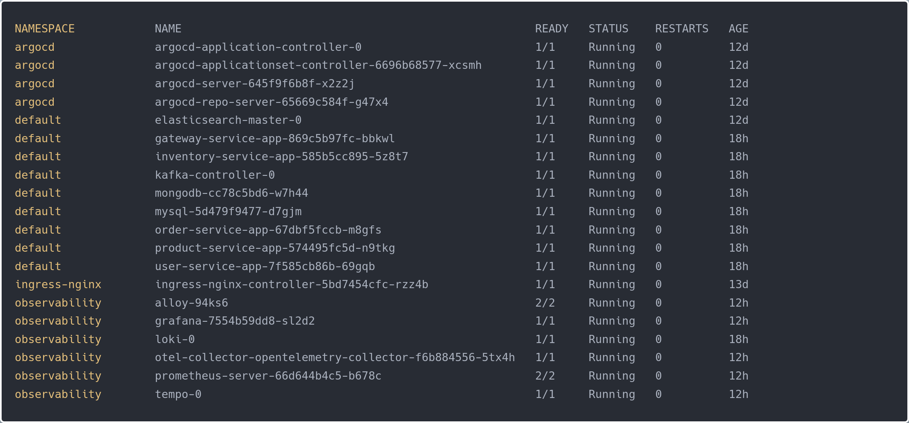
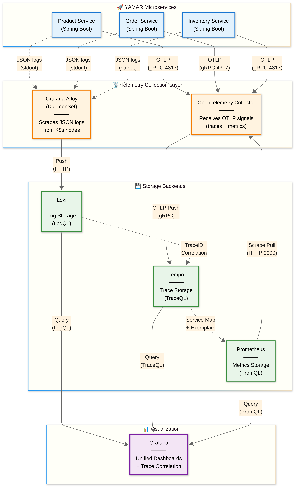
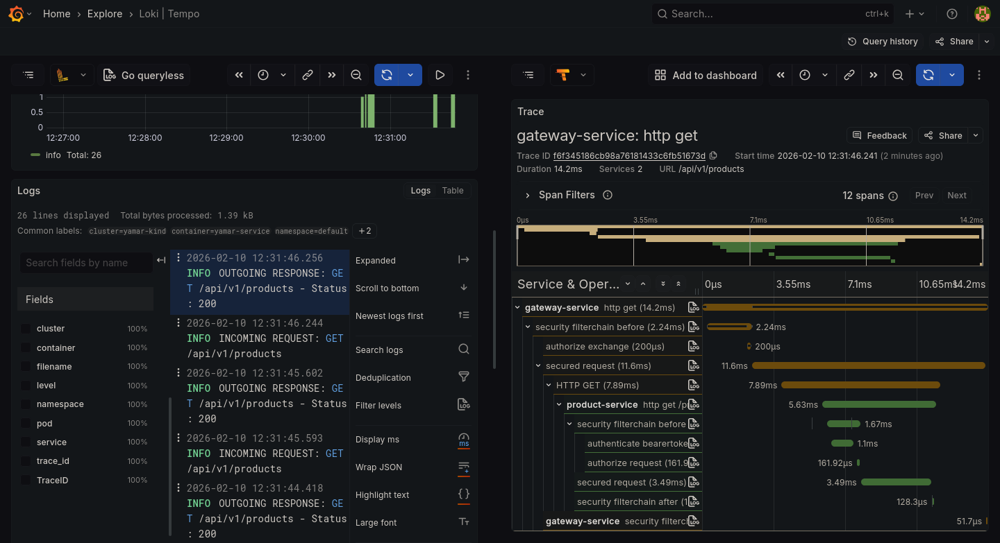
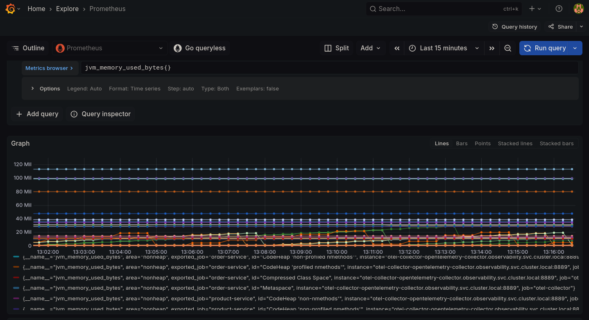
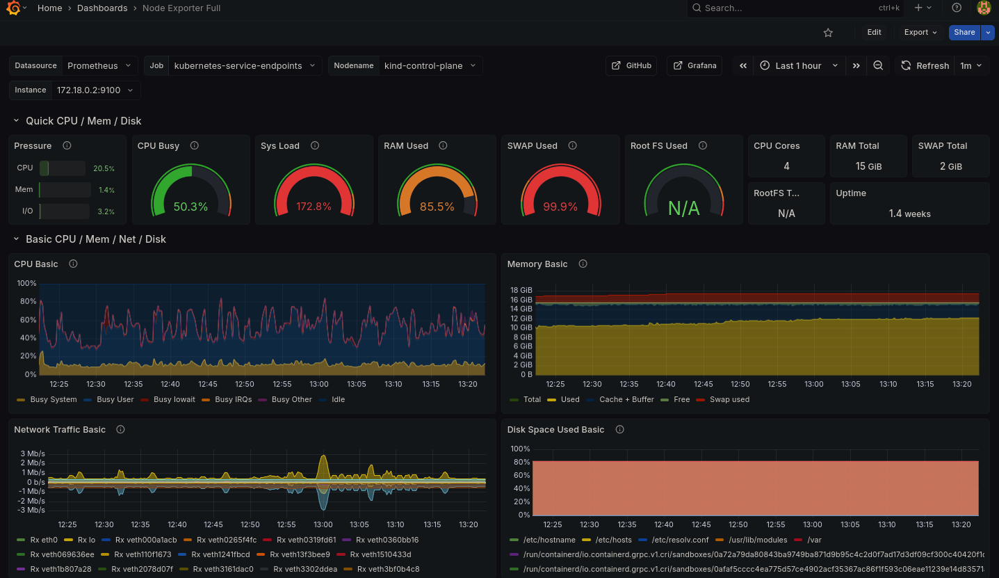
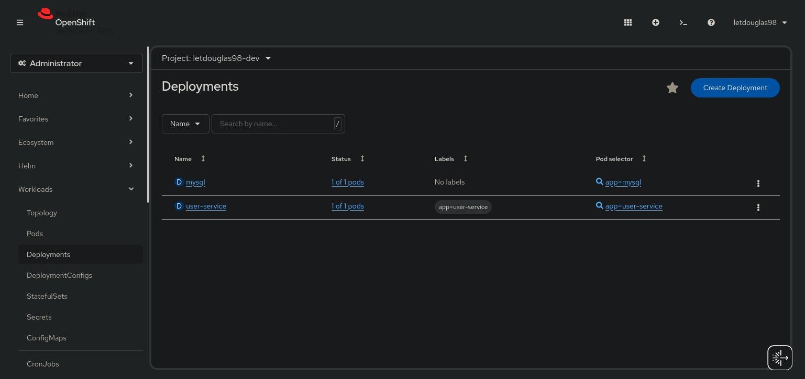
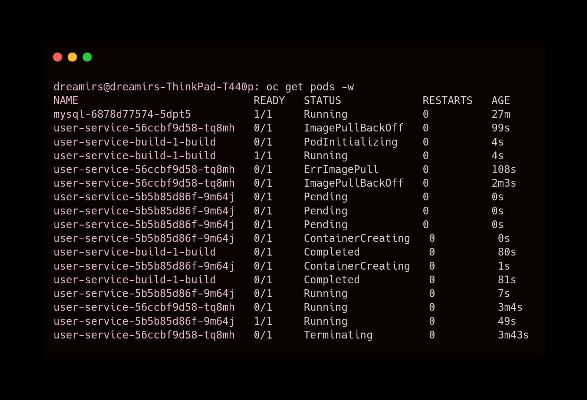
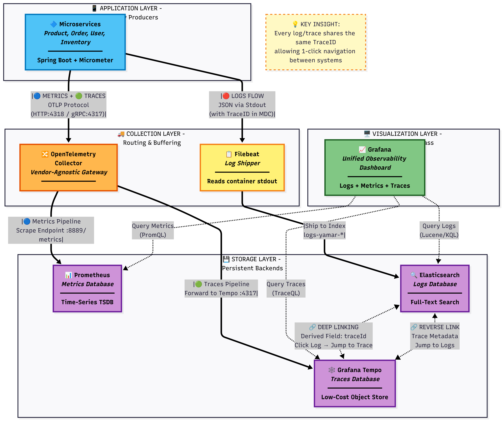

# 🏔️ YAMAR: Cloud-Native E-Commerce Reference Architecture

<!-- Tech Stack -->
-ED8B00?style=for-the-badge&logo=openjdk&logoColor=white)


<!-- DevOps & Observability -->


<!-- Project Status -->


---

## 📖 Executive Summary

**YAMAR** is a production-grade, cloud-native microservices platform designed to demonstrate advanced architectural
patterns for distributed systems at scale. Built on Java 21 and Spring Boot 3, the ecosystem implements **CQRS**, *
*Event-Driven Choreography**, and **Polyglot Persistence** using Apache Kafka as the central nervous system.

What sets YAMAR apart is its **Infrastructure-as-Code first** philosophy. The entire platform is orchestrated via *
*ArgoCD GitOps**, leveraging the **App-of-Apps pattern** for hierarchical application management and the **Multiple
Sources strategy** to decouple upstream Helm charts from local configuration overlays.

The observability layer follows the **LGTM stack** (Loki, Grafana, Tempo, Prometheus) with **OpenTelemetry** as the
unified telemetry protocol. This architecture eliminates vendor lock-in, ensures correlation across all three pillars of
observability (Logs ↔ Traces ↔ Metrics), and supports horizontal scaling without application-level code changes.

This is not a tutorial project—it's a **reference implementation** for building resilient, observable, and maintainable
distributed systems in Kubernetes-native environments.

---

## 📋 Table of Contents

- [System Architecture](#-system-architecture)
- [Core Architectural Patterns](#-core-architectural-patterns)
- [The Golden Path: GitOps Deployment](#-the-golden-path-gitops-deployment)
- [Observability Architecture: The LGTM Stack](#-observability-architecture-the-lgtm-stack)
- [Technology Stack](#-technology-stack)
- [Local Development Workflow](#-local-development-workflow)
- [Enterprise Platform Integration (Red Hat OpenShift)](#-enterprise-platform-integration-red-hat-openshift)
- [Architecture Evolution & Legacy Labs](#-architecture-evolution--legacy-labs)
- [Troubleshooting](#-troubleshooting)
- [Contributing](#-contributing)

---

## 🏗️ System Architecture

YAMAR follows a **Domain-Driven Design (DDD)** approach where each microservice represents a bounded context.
Communication is decoupled through a hybrid model: synchronous REST calls for queries (via API Gateway) and asynchronous
events for commands (via Kafka), ensuring loose coupling and fault isolation.


*High-level view of the YAMAR microservices ecosystem showing the API Gateway, event bus, and polyglot persistence
layer.*

### Key Components

| Service               | Responsibility                                    | Persistence                 | Communication Pattern   |
|-----------------------|---------------------------------------------------|-----------------------------|-------------------------|
| **API Gateway**       | Centralized routing, auth relay, circuit breaking | Stateless                   | Synchronous (REST)      |
| **Product Service**   | CQRS: Commands (MongoDB), Queries (Elasticsearch) | Dual-write + Event Sourcing | Kafka Producer/Consumer |
| **Order Service**     | Saga orchestration, order lifecycle management    | MySQL (Transactional)       | Kafka Producer          |
| **Inventory Service** | Stock tracking, reservation logic                 | MongoDB                     | Kafka Consumer          |
| **User Service**      | Identity, profile management                      | MySQL                       | REST                    |

---

## 🧠 Core Architectural Patterns

### 1. Polyglot Persistence for Performance Optimization

The **Product Service** implements separate data stores for writes and reads:

- **Write Path:** All mutations (POST/PUT/DELETE) are committed to **MongoDB**, the source of truth. Upon success, a
  `ProductUpdatedEvent` is published to Kafka.
- **Read Path:** A dedicated consumer synchronizes data into **Elasticsearch**, which serves all GET requests with
  sub-millisecond latency.

**Why this matters from a DevOps perspective:** This separation allows independent scaling of search infrastructure (
Elasticsearch clusters) without impacting transactional workloads. Read replicas can be added/removed based on traffic
patterns without touching the write database.

### 2. Event-Driven Communication via Kafka

Services communicate asynchronously through **Apache Kafka** to ensure loose coupling. For example:

1. The **Order Service** emits an `OrderPlacedEvent` to Kafka.
2. The **Inventory Service** consumes this event and decrements stock independently.
3. If inventory reservation fails, a compensating event is published to roll back the order.

**Why this matters from a DevOps perspective:** Event-driven architecture enables:

- **Zero-downtime deployments:** Services can be updated independently without breaking request/response chains.
- **Horizontal scaling:** Add consumers to any service without application code changes.
- **Failure isolation:** One service crash doesn't cascade to others; Kafka retains events for replay.

### 3. Kubernetes-Native Service Discovery

YAMAR relies on **Kubernetes DNS** for service discovery. Every microservice is addressable via its Service name (e.g.,
`http://order-service:8042`). This eliminates the need for external service registries like Eureka or Consul.

**Why this matters from a DevOps perspective:
** Reduces operational complexity and leverages battle-tested DNS resolution built into Kubernetes. One less component to manage, monitor, and troubleshoot.
---

## 🚀 The Golden Path: GitOps Deployment

YAMAR is designed for **declarative infrastructure management** via ArgoCD. The entire deployment lifecycle—from
infrastructure dependencies (Kafka, databases) to application services—is governed by Git commits.

### Architecture: App-of-Apps Pattern

The deployment follows ArgoCD's **App-of-Apps pattern**, where a single bootstrap application (`apps/bootstrap.yaml`)
defines child applications for each layer of the stack:

```
bootstrap (ArgoCD App)
├── infrastructure (Kafka, DBs, Ingress)
├── observability (Loki, Tempo, Prometheus, Grafana)
└── microservices (Product, Order, User, Inventory)
```

Each child application uses the **Multiple Sources strategy**, separating:

- **Helm Chart Source:** Official upstream charts (e.g., Bitnami Kafka, Grafana Loki).
- **Values Source:** Local Git repository containing environment-specific overrides.

This ensures that updates to official charts do not require merging changes into our Git repository—true separation of
concerns.


*The hierarchical App-of-Apps pattern in action: The `yamar-bootstrap` application
(center) orchestrates 14+ child applications across Infrastructure (Kafka, databases,
observability stack) and Microservices layers. Every component is managed declaratively
via Git commits, with automatic health checks and sync status tracking.*

> **💡 What You're Seeing:**
> - **Bootstrap App (center):** Root application managing all children
> - **Infrastructure (top):** Stateful services (Kafka, MySQL, MongoDB, Elasticsearch)
> - **Observability (middle):** LGTM stack (Loki, Grafana, Tempo, Prometheus, OTel Collector)
> - **Microservices (bottom):** Business logic services (Product, Order, Inventory, User)
> - **Green indicators:** All applications are healthy and synchronized with the Git repository

### Universal Helm Chart: Zero-Config Microservices

All YAMAR microservices are deployed using a **single, reusable Helm chart** (`infra/charts/yamar-service`). This chart
implements the **Global Injection pattern**, automatically injecting OpenTelemetry configuration into every pod via
environment variables:

```yaml
# Automatically injected into all microservices
OTEL_EXPORTER_OTLP_ENDPOINT: "http://otel-collector:4317"
OTEL_RESOURCE_ATTRIBUTES: "service.name={{ .Values.serviceName }}"
SPRING_PROFILES_ACTIVE: "kubernetes,otel"
```

**Why this matters:** Developers write zero observability boilerplate. The infrastructure team controls telemetry
routing centrally. This is **DRY (Don't Repeat Yourself)** at the platform level.

### Deployment Instructions

#### Prerequisites

- Kubernetes cluster (Kind, Minikube, or cloud-managed)
- `kubectl` CLI
- ArgoCD installed (or use the included manifest)

#### Step 1: Install ArgoCD (One-Time Setup)

```bash
kubectl create namespace argocd
kubectl apply -n argocd -f https://raw.githubusercontent.com/argoproj/argo-cd/stable/manifests/install.yaml

# Wait for ArgoCD to be ready
kubectl wait --for=condition=available --timeout=300s deployment/argocd-server -n argocd
```

#### Step 2: Bootstrap the Entire Ecosystem

```bash
# Apply the root application (App-of-Apps)
kubectl apply -f infra/gitops/bootstrap.yaml

# Monitor synchronization status
kubectl get applications -n argocd --watch
```

**That's it.** ArgoCD will recursively deploy infrastructure, observability, and application layers. Any changes to
`infra/` committed to the Git repository will trigger automatic reconciliation.

#### Step 3: Access the System

Once all applications are synced:

- **ArgoCD UI:** `kubectl port-forward svc/argocd-server -n argocd 8080:443` → `https://localhost:8080`
- **Grafana Dashboards:** `kubectl port-forward svc/grafana -n observability 3000:80` → `http://localhost:3000`
- **API Gateway:** Depends on Ingress configuration (default: `http://api.local`)

### ✅ System Health Check

To verify the integrity of the ecosystem, here is a snapshot of the active pods across all specialized namespaces (
GitOps, Observability, and Business Logic):

<details>
<summary><b>Click to view live cluster state (Carbon Terminal)</b></summary>



</details>

---

## 👁️ Observability Architecture: The LGTM Stack

The following diagram shows the end-to-end telemetry pipeline from application instrumentation to unified visualization:


*Telemetry flow: Applications emit OTLP and JSON logs → Collectors aggregate → Backends store → Grafana correlates
everything.*

### Architecture Components

| Component                   | Role                                 | Protocol                |
|-----------------------------|--------------------------------------|-------------------------|
| **Grafana Alloy**           | Log collection from Kubernetes nodes | JSON scraping → Loki    |
| **OpenTelemetry Collector** | Trace/Metrics aggregation            | OTLP → Tempo/Prometheus |
| **Loki**                    | Log storage and querying             | LogQL                   |
| **Tempo**                   | Distributed trace storage            | TraceQL                 |
| **Prometheus**              | Metrics storage and alerting         | PromQL                  |
| **Grafana**                 | Unified visualization layer          | All data sources        |

### Correlation in Action: Logs ↔ Traces

One of the key advantages of the LGTM stack is **automatic correlation** between logs and traces. Every log entry
contains a `traceId` field, which Grafana uses to link directly to the corresponding trace in Tempo.


*Clicking a TraceID in any Loki log entry instantly opens the correlated distributed trace waterfall in Tempo,
drastically reducing MTTR (Mean Time To Repair).*

### Application Telemetry: OTLP in Action

Applications push metrics via **OpenTelemetry Protocol (OTLP)** to the OTel Collector, which then exposes them for
Prometheus scraping. This decouples microservices from specific metrics backends.


*JVM health metrics (heap usage, GC pauses, thread pools) pushed from Spring Boot applications to the OTel Collector via
OTLP.*

### Infrastructure Monitoring: Node-Level Visibility

Beyond application metrics, the stack monitors cluster health via **Node Exporter** and **kube-state-metrics**,
providing real-time visibility into CPU saturation, memory pressure, and disk I/O.

<details>
<summary><b>View Infrastructure Health Dashboard</b></summary>


*Node-level resource tracking: real-time monitoring of CPU, memory, network I/O, and disk utilization across all
Kubernetes nodes.*

</details>

### Why LGTM Over Traditional Stacks?

| Feature                | ELK Stack (Legacy)       | LGTM Stack (Current)     |
|------------------------|--------------------------|--------------------------|
| **Vendor Lock-In**     | Elastic ecosystem only   | Vendor-neutral (CNCF)    |
| **Trace Correlation**  | Requires APM plugin ($$) | Native via TraceID       |
| **Resource Overhead**  | High (Java-based)        | Low (Go-based)           |
| **Query Language**     | KQL (Kibana)             | LogQL + TraceQL + PromQL |
| **Horizontal Scaling** | Complex sharding         | Cloud-native by design   |

> **Note:** The legacy ELK architecture is preserved in `infra/compose/` for educational comparison. See
> the [Architecture Evolution](#-architecture-evolution--legacy-labs) section for details.

---

## 🛠️ Technology Stack

| Layer                       | Technology                        | Justification                                                                                              |
|-----------------------------|-----------------------------------|------------------------------------------------------------------------------------------------------------|
| **Runtime**                 | Java 21 (LTS), Spring Boot 3.x    | Long-term support, native OpenTelemetry integration via Micrometer.                                        |
| **API Gateway**             | Spring Cloud Gateway (Reactive)   | Non-blocking I/O, built-in circuit breakers (Resilience4j), OAuth2 token relay.                            |
| **Messaging**               | Apache Kafka (KRaft mode)         | Removes Zookeeper dependency, simplifies operations. Schema Registry ensures type safety with Avro.        |
| **Databases**               | MongoDB, MySQL 8, Elasticsearch 8 | Polyglot Persistence: Document store for catalogs, relational for transactions, search engine for queries. |
| **GitOps**                  | ArgoCD                            | Declarative, pull-based deployment with drift detection and self-healing.                                  |
| **Packaging**               | Helm 3                            | Manages complex stateful dependencies (Kafka, databases) with templating and lifecycle hooks.              |
| **Telemetry Protocol**      | OpenTelemetry (OTLP)              | Vendor-neutral, CNCF standard for logs, traces, and metrics.                                               |
| **Observability**           | Grafana LGTM Stack                | Loki (logs), Grafana (UI), Tempo (traces), Prometheus (metrics).                                           |
| **Log Collector**           | Grafana Alloy                     | Programmable pipeline (River language), Kubernetes-native.                                                 |
| **Trace/Metrics Collector** | OpenTelemetry Collector           | Central aggregation point, decouples applications from backends.                                           |

---

## 💻 Local Development Workflow

While production deployment uses GitOps, developers can iterate rapidly using **local Kubernetes clusters** (Kind,
Minikube) or **Docker Compose** for faster feedback loops.

### Option 1: Kind + Skaffold (Kubernetes-Native Development)

Skaffold watches local source files and automatically rebuilds/redeploys changed services into the cluster.

#### Prerequisites

```bash
brew install kind kubectl helm skaffold
```

#### Setup

```bash
# Create Kind cluster with Ingress support
kind create cluster --config infra/k8s/kind-config.yml

# Install NGINX Ingress Controller
kubectl apply -f https://raw.githubusercontent.com/kubernetes/ingress-nginx/main/deploy/static/provider/kind/deploy.yaml

# Start live development (watches for code changes)
skaffold dev
```

Any change to a Java file will trigger a rebuild of only the affected service, with hot-reload into the cluster.

### Option 2: Docker Compose (Fast Prototyping)

For testing business logic without Kubernetes overhead, use the Docker Compose stack:

```bash
cd infra/compose
docker-compose up -d
```

This spins up a minimal environment with the observability stack (Grafana, Loki, Tempo, Prometheus) and infrastructure
dependencies (Kafka, MongoDB). Microservices can be run locally in your IDE, connecting to these shared resources.

**Note:** This environment uses the legacy ELK stack for simplicity. See
the [Legacy Labs](#-architecture-evolution--legacy-labs) section for details.

---

## ☁️ Enterprise Platform Integration (Red Hat OpenShift)

YAMAR includes a production-ready deployment configuration for **Red Hat OpenShift**, demonstrating enterprise-grade
CI/CD automation.

### Key Features

- **Native S2I (Source-to-Image) Pipeline:** Builds container images directly inside the cluster using Red Hat UBI base
  images, eliminating external Docker registries.
- **GitHub Webhook Integration:** Fully automated build-and-deploy cycle triggered by `git push`.
- **RBAC Security Tuning:** Custom `RoleBinding` allows webhook triggers while maintaining least-privilege access.
- **Persistent Storage:** MySQL backed by `PersistentVolumeClaim` for data durability.


*OpenShift console showing deployed microservices with automated rollout status.*


*OpenShift self-healing in action: The system automatically recovers from ImagePullBackOff after the S2I build
completes.*

👉 **[Full OpenShift Technical Documentation](./infra/openshift/README.md)**

---

## 🗄️ Architecture Evolution & Legacy Labs

YAMAR is a **living project** that has evolved through multiple architectural iterations. Rather than deleting previous
implementations, they are preserved as **reference labs** to demonstrate understanding of trade-offs between different
approaches.

### The Docker Compose Lab (Local Prototyping)

**Location:** `infra/compose/`

This environment represents the **initial prototype phase**, using Docker Compose for rapid local development. It
includes:

- **ELK Stack:** Filebeat → Elasticsearch → Kibana for log aggregation.
- **Standalone Kafka:** Single-node Kafka without Kubernetes orchestration.
- **Monolithic Configuration:** All services configured via `docker-compose.yml` without Helm templating.


*Original observability architecture using the ELK stack with Filebeat as the log shipper. This approach was later
replaced by the LGTM stack for vendor neutrality and better trace correlation.*

**Use Case:** Ideal for developers who want to test business logic changes without the overhead of a Kubernetes cluster.
Great for onboarding new team members.

**Why it's preserved:** Demonstrates the natural evolution from ELK to LGTM observability. Useful for comparing the
operational complexity between agent-based (Filebeat) and pull-based (Alloy) log collection.

### Vanilla Kubernetes Manifests (Archive)

**Location:** `infra/archive/k8s/`

This directory contains **raw YAML manifests** from the first Kubernetes migration, before GitOps adoption. Services
were deployed using `kubectl apply -f`, requiring manual synchronization and version control.

**Limitations:**

- No declarative drift detection (manual checks required).
- Configuration duplication across environments (dev, staging, prod).
- No rollback mechanism beyond manual `kubectl rollout undo`.

**Why it's preserved:** Serves as a teaching tool for understanding the pain points that GitOps solves. Demonstrates why
ArgoCD's App-of-Apps pattern is superior for managing complex deployments.

### Red Hat OpenShift POC (Enterprise Validation)

**Location:** `infra/openshift/`

A specialized deployment targeting Red Hat OpenShift Container Platform, showcasing:

- **S2I (Source-to-Image):** Platform-native build strategy that compiles Java applications inside the cluster using
  certified UBI images.
- **Webhook-Driven CI/CD:** GitHub integration for automated builds on every commit.
- **Enterprise Security Hardening:** RBAC policies, network isolation, and encrypted secrets management.

**Why it's preserved:** Proves the platform's adaptability to enterprise environments with strict security and
compliance requirements. Useful for organizations evaluating Kubernetes distributions.

### Evolution Summary Table

| Phase                         | Orchestration       | Deployment Method      | Observability        | Status            |
|-------------------------------|---------------------|------------------------|----------------------|-------------------|
| **Phase 1: Compose**          | Docker Compose      | `docker-compose up`    | ELK Stack (Filebeat) | Legacy Lab        |
| **Phase 2: Vanilla K8s**      | Kubernetes (manual) | `kubectl apply -f`     | Prometheus + Grafana | Archived          |
| **Phase 3: OpenShift**        | OpenShift (S2I)     | Webhook → BuildConfig  | Prometheus           | Production PoC    |
| **Phase 4: GitOps (Current)** | ArgoCD              | Git commit → Auto-sync | LGTM Stack (Alloy)   | **Gold Standard** |

**Architectural Insight:** This progression mirrors the maturity model of most cloud-native organizations:

1. Start simple (Compose for local dev).
2. Move to Kubernetes (imperative `kubectl` commands).
3. Harden for enterprise (OpenShift S2I, RBAC).
4. Adopt GitOps (declarative, auditable, self-healing).

The fact that all phases are preserved in the repository demonstrates **architectural humility**—acknowledging that no
single approach is universally optimal, and that context (team size, compliance requirements, budget) drives tooling
decisions.

---

## 🚑 Troubleshooting

### Common Issues and Resolutions

| Problem                                       | Symptoms                                                     | Root Cause                                                                                         | Solution                                                                                                                                                                 |
|-----------------------------------------------|--------------------------------------------------------------|----------------------------------------------------------------------------------------------------|--------------------------------------------------------------------------------------------------------------------------------------------------------------------------|
| **ArgoCD Application Stuck in 'Progressing'** | Application shows yellow status indefinitely.                | Helm chart dependency is unhealthy (e.g., Kafka CrashLoopBackOff).                                 | Check logs: `kubectl logs -n <namespace> <pod-name>`. Verify PersistentVolumes are bound: `kubectl get pv`.                                                              |
| **Logs Not Appearing in Loki**                | Grafana Explore shows "No data".                             | Grafana Alloy DaemonSet is not running or misconfigured.                                           | Verify Alloy pods: `kubectl get pods -n observability -l app=alloy`. Check logs: `kubectl logs -n observability <alloy-pod>`. Ensure the River pipeline syntax is valid. |
| **Traces Missing in Tempo**                   | Requests appear in logs but not in trace viewer.             | OpenTelemetry Collector is not receiving spans, or applications are not configured to export OTLP. | Check Collector logs: `kubectl logs -n observability <otel-collector-pod>`. Verify environment variables in application pods: `kubectl exec <pod> -- env \| grep OTEL`.  |
| **Metrics Not Scraped by Prometheus**         | PromQL queries return empty results.                         | Prometheus cannot reach the OpenTelemetry Collector's `/metrics` endpoint.                         | Check ServiceMonitor: `kubectl get servicemonitor -n observability`. Verify Prometheus targets: Open Prometheus UI → Status → Targets.                                   |
| **Kafka Pods in CrashLoopBackOff**            | Kafka broker fails to start.                                 | Insufficient disk space or memory. PersistentVolume claim is pending.                              | Increase resources in `values.yaml`: `resources.limits.memory: 2Gi`. Check PVC status: `kubectl get pvc -n infrastructure`.                                              |
| **Database Connection Refused**               | Application logs show "Connection refused" to MySQL/MongoDB. | Database pods are not ready, or Service DNS is misconfigured.                                      | Verify database pods are running: `kubectl get pods -n infrastructure`. Test DNS resolution from application pod: `kubectl exec <app-pod> -- nslookup mysql-service`.    |

### Debugging Commands Cheat Sheet

```bash
# Check ArgoCD sync status
kubectl get applications -n argocd

# View application logs
kubectl logs -n <namespace> <pod-name> --tail=100 -f

# Inspect pod configuration (useful for checking injected env vars)
kubectl get pod <pod-name> -n <namespace> -o yaml

# Port-forward to access internal services
kubectl port-forward -n observability svc/grafana 3000:80

# Force ArgoCD to re-sync an application
argocd app sync <app-name>

# Check Helm release status
helm list -n <namespace>
```

---

## 🤝 Contributing

Contributions are welcome! This project is designed as a **living reference architecture**, and improvements that
demonstrate additional patterns or technologies are encouraged.

### How to Contribute

1. Fork the repository.
2. Create a feature branch: `git checkout -b feature/awesome-pattern`.
3. Commit your changes with descriptive messages: `git commit -m "Add circuit breaker pattern to Order Service"`.
4. Push to your fork: `git push origin feature/awesome-pattern`.
5. Open a Pull Request with a detailed explanation of the architectural rationale.

### Areas for Enhancement

- **Advanced Traffic Management:** Implement Istio or Linkerd for mTLS and traffic splitting.
- **Chaos Engineering:** Add Chaos Mesh experiments to validate resilience.
- **Multi-Cluster GitOps:** Extend ArgoCD to manage deployments across multiple Kubernetes clusters.
- **Policy Enforcement:** Integrate Open Policy Agent (OPA) for automated compliance checks.

---

## 📝 License

This project is developed for **educational and portfolio purposes**. It is open-source and available for learning, but
not intended for production use without additional security hardening and operational readiness assessments.

---

## 🙏 Acknowledgments

This architecture was designed to reflect real-world production patterns used by engineering teams at scale. Special
thanks to the CNCF community for providing open-source tools like OpenTelemetry, ArgoCD, and the Grafana LGTM stack,
which make platforms like YAMAR possible without vendor lock-in.

---

**Built with ❤️ to demonstrate Cloud-Native Engineering Excellence**  
*For questions or collaboration opportunities, feel free to open an issue or reach out via the repository's Discussions
tab.*