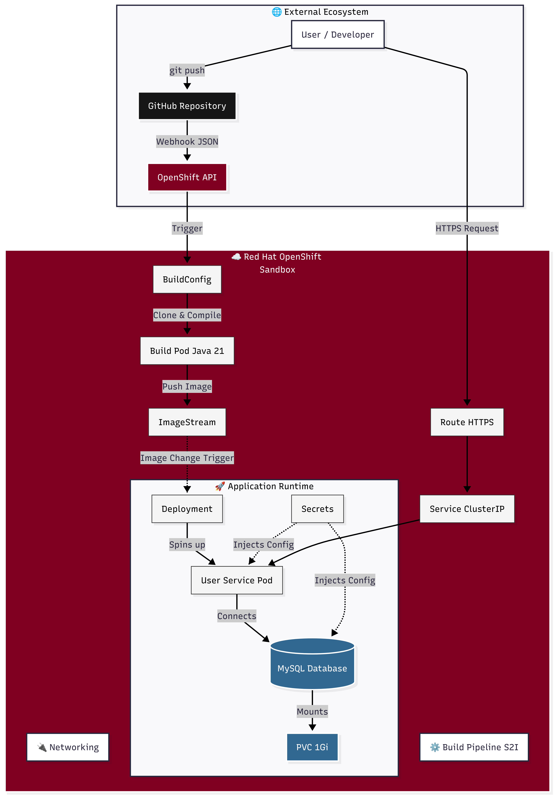
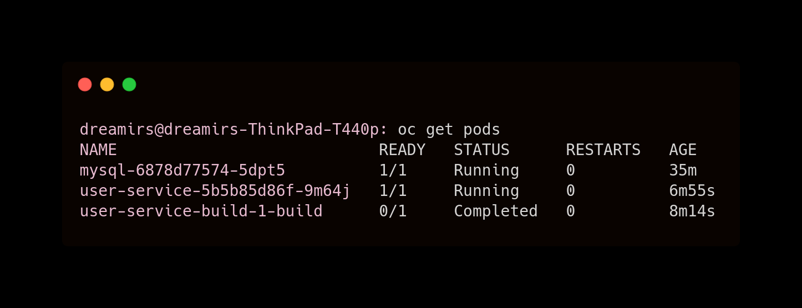
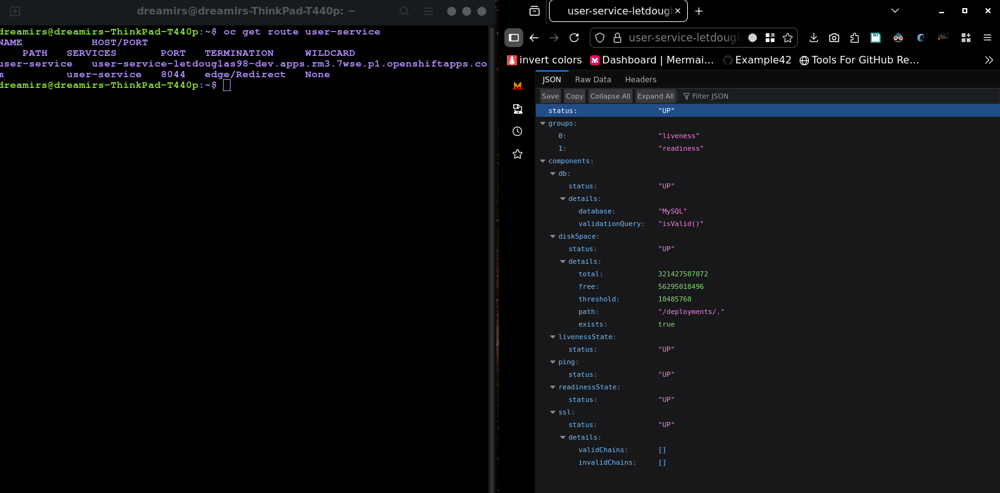

[← Back to Main README](../../README.md)
# ☁️ OpenShift Architecture & Implementation Details



This document details the technical implementation of the **YAMAR User Service** on **Red Hat OpenShift**. It describes the declarative CI/CD workflow, security configurations, and the architectural decisions made to optimize the microservice for a cloud-native environment.

---

## 📂 Manifest Catalog

| File | Resource Type | Purpose |
|:-----|:-------------|:--------|
| `mysql-db.yaml` | Deployment + SVC + PVC | Provisions a MySQL 8.0 instance with 1Gi persistent storage and internal DNS resolution. |
| `user-service-build.yaml` | BuildConfig + IS | Defines the **Source-to-Image (S2I)** pipeline using UBI 9 OpenJDK 21. Handles automated image builds. |
| `user-service-deploy.yaml` | Deployment + SVC + Route | Manages the application runtime, including Rolling Updates, Health Probes, and HTTPS exposure. |
| `webhook-rbac.yaml` | RoleBinding | Configures RBAC to allow GitHub Webhook triggers to communicate with the OpenShift API. |
| `auth0-secret.example.yaml` | Secret (Template) | Template for Auth0 Issuer URI and OIDC credentials. |
| `webhook-secret.example.yaml` | Secret (Template) | Template for the Webhook authentication token. |

> **Note:** Actual secret files are excluded via `.gitignore`. Environment-specific credentials must be applied manually or via a secure vault before deployment.

---

## 🧠 Technical Design Decisions

### 1. Maven Multi-Module Build Strategy
The YAMAR ecosystem is structured as a Maven Multi-Module project. To build the `user-service` independently while maintaining access to the parent POM, the `BuildConfig` was tuned as follows:

* **Context Root:** Set to `/` to allow the S2I builder to resolve the parent `pom.xml`.
* **Selective Compilation:** Used `MAVEN_ARGS_APPEND` with `-pl services/user-service -am` to isolate the build to the specific module and its required dependencies.
* **Artifact Localization:** Implemented `MAVEN_S2I_ARTIFACT_DIRS` to explicitly point the builder to the nested `target` folder, ensuring the correct JAR is identified for the final image layer.

### 2. RBAC for External Webhook Triggers
To enable automated CI/CD from GitHub without compromising cluster security, a specific RBAC policy was implemented:

* **Problem:** Default OpenShift policies block unauthenticated POST requests to the build API.
* **Solution:** Applied a `RoleBinding` granting the `system:webhook` role to the `system:unauthenticated` group within the project namespace.
* **Security:** Access is strictly limited to the webhook endpoint and is protected by a unique secret token passed in the URL.

### 3. Hybrid Configuration Management
To avoid "Configuration Drift" and keep manifest files maintainable, a hybrid strategy was adopted:

* **Static Configuration:** Application-level settings (logging levels, disabling local telemetry) are encapsulated in a dedicated `openshift` Spring profile within the source code.
* **Dynamic Configuration:** Infrastructure-level settings (DB endpoints, Secrets) are injected via the `Deployment` manifest.
* **Rationale:** This ensures **Image Immutability**. The same binary can run in different environments simply by switching the active Spring profile and injecting different secrets.

---

## 🧪 Verification & Status

### 1. Automated Deployment Flow (Self-Healing)
The following capture demonstrates the resilience of the pipeline. When the manifests are first applied, the system enters a transient `ImagePullBackOff` state. Once the build is completed via webhook, OpenShift automatically triggers a rollout, terminating the placeholder pods and spawning the functional version.


### 2. Runtime Stability (Final State)
Once the convergence is reached, the environment remains stable with minimal resource overhead. The build pod is kept in a `Completed` state for audit logs.



### 3. Public Route & Health Check
The application is exposed through an OpenShift Route with **Edge TLS termination** (automated HTTPS). Connectivity to the backend MySQL database is verified through the Spring Boot Actuator health endpoint.



*   **Endpoint:** `/api/v1/actuator/health`
*   **Status:** `UP`
*   **Database:** Verified (HikariPool Connection)

---

## 🛠️ Disaster Recovery & Environment Restore

In the event of an environment reset, the full stack can be reconstructed using the following sequence:

```bash
# 1. Infrastructure & Permissions  
oc apply -f infra/openshift/mysql-db.yaml  
oc apply -f infra/openshift/webhook-rbac.yaml  
  
# 2. Security (Apply local secrets)  
oc apply -f infra/openshift/auth0-secret.yaml  
oc apply -f infra/openshift/webhook-secret.yaml  
  
# 3. Pipelines & Runtime  
oc apply -f infra/openshift/user-service-build.yaml  
oc apply -f infra/openshift/user-service-deploy.yaml  
  
# 4. Manual Trigger (Optional)  
oc start-build user-service-build  
```

---

## 📊 Roadmap & Production Readiness

While this PoC demonstrates the core architectural flow, the following enhancements are planned for a full production environment:

| Feature                | Objective                                                              |
| ---------------------- | ---------------------------------------------------------------------- |
| GitOps Integration     | Migrate from Webhooks to ArgoCD for pull-based synchronization.        |
| Advanced Observability | Deploy an OpenTelemetry Collector sidecar to aggregate traces.         |
| Secret Encryption      | Implement Sealed Secrets to allow encrypted credentials in VCS.        |
| Auto-scaling           | Configure HPA (Horizontal Pod Autoscaler) based on CPU/Memory metrics. |

*Standardized for OpenShift Container Platform v4.x
